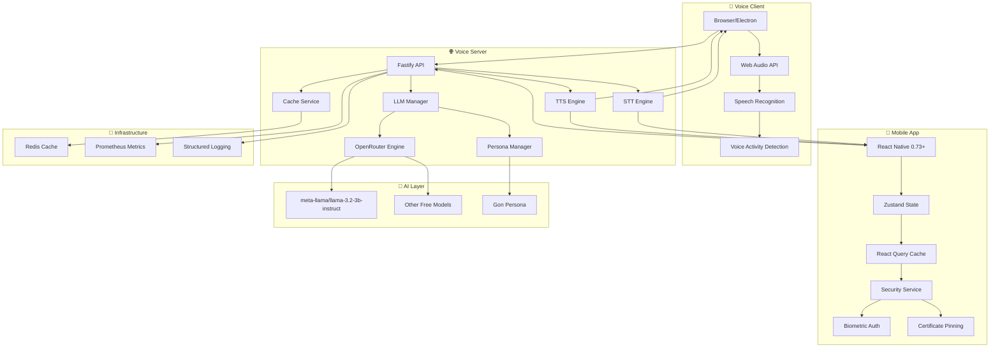

# 🎭 Gon - Personal Voice Assistant

A **real-time voice assistant** with Brazilian Portuguese personality, built with modern TypeScript architecture and AI-powered conversation capabilities. Now featuring a **2025-ready mobile app** with enterprise-grade security and performance.

## 🌟 Features

- **🎭 Gon Persona**: Brazilian Portuguese assistant with warm, friendly personality
- **🎤 Real-time Voice**: Speech-to-Text and Text-to-Speech processing
- **🧠 AI-Powered**: OpenRouter LLM integration with intelligent routing
- **⚡ High Performance**: Sub-second response times with caching
- **🔒 Privacy-First**: Local processing with cloud fallback
- **🖥️ Cross-Platform**: Desktop apps for macOS, Linux, and Windows
- **📱 Progressive Web App**: Installable web app with offline support
- **📱 Mobile App**: React Native 0.73+ app with 2025 best practices
- **🔐 Enterprise Security**: Biometric auth, certificate pinning, encryption
- **🧪 Production Ready**: Comprehensive testing and monitoring

## 🏗️ Architecture



## 📦 Monorepo Structure

```
real-time-stt-with-tts/
├── packages/
│   ├── shared/
│   │   ├── schemas/          # Zod schemas for type safety
│   │   ├── config/           # Environment configuration
│   │   └── observability/    # Logging & metrics
│   ├── engines/
│   │   ├── llm-openrouter/   # Cloud OpenRouter integration
│   │   ├── llm-manager/      # Intelligent routing & persona
│   │   ├── stt-whisper-cpp/  # STT engine
│   │   └── tts-piper/        # TTS engine
│   ├── server/               # Node.js Fastify server
│   ├── client-app/           # React PWA client
│   └── mobile-app/           # React Native 0.73+ mobile app
├── voice-assistant-electron/ # Cross-platform desktop app
├── tests/                    # E2E test suite
└── pnpm-workspace.yaml       # Monorepo configuration
```

## 🎭 Gon Persona

Gon is a Brazilian Portuguese voice assistant with a warm, friendly personality:

### Personality Traits
- **Friendly and warm** - Always welcoming and approachable
- **Enthusiastic about helping** - Loves to assist with any task
- **Uses Brazilian Portuguese naturally** - Native language fluency
- **Loves technology and innovation** - Tech-savvy and curious
- **Patient and understanding** - Never rushes or gets frustrated
- **Has a sense of humor** - Light-hearted and fun to talk to

### Language & Voice
- **Language**: Brazilian Portuguese (pt-BR)
- **Voice**: Natural, conversational tone
- **Style**: Uses Brazilian expressions and slang naturally
- **Responses**: Optimized for voice interaction (concise, clear)

## 🚀 Quick Start

### Prerequisites

```bash
# Node.js 20+ and PNPM
node --version  # v20+
pnpm --version  # v8+

# OpenRouter API Key (for AI responses)
export OPENROUTER_API_KEY="your-api-key-here"
```

### Installation

```bash
# Clone the repository
git clone <repository-url>
cd real-time-stt-with-tts

# Install dependencies
pnpm install

# Build all packages
pnpm -r build
```

### Development

```bash
# Start development servers
pnpm dev

# This will start:
# - Server: http://localhost:3030
# - Client: http://localhost:5173
# - HTTP Server: http://localhost:8080 (for testing)
```

### Mobile App Development

```bash
# Navigate to mobile app
cd packages/mobile-app

# Install dependencies
pnpm install

# iOS Setup (macOS only)
cd ios && pod install && cd ..

# Start Metro bundler
pnpm start

# Run on device/simulator
pnpm ios      # iOS
pnpm android  # Android

# Run tests
pnpm test
pnpm test:coverage

# Security audit
pnpm security:audit
```

### Testing

```bash
# Run E2E tests
pnpm test:e2e

# Run unit tests
pnpm test

# Run all tests
pnpm test:all

# Run tests with coverage
pnpm test:coverage
```

## 📱 Mobile App - 2025 Edition

### 🆕 **New Features**

#### **Modern Architecture**
- **React Native 0.73+** with New Architecture support
- **Zustand** for lightweight state management
- **React Query** for server state and caching
- **TypeScript-first** development with strict typing
- **Modern testing** with React Native Testing Library

#### **Enterprise Security**
- **🔐 Biometric Authentication** (TouchID, FaceID, Fingerprint)
- **🔒 Certificate Pinning** for API communication
- **🔑 Secure Keychain Storage** for sensitive data
- **🛡️ Device Security Checks** (root detection, emulator detection)
- **🔐 SSL Pinning** for network security
- **🔒 Data Encryption** at rest and in transit

#### **Performance & UX**
- **⚡ Hermes Engine** for improved performance
- **🎨 Beautiful UI** with gradient backgrounds and animations
- **📱 Responsive Design** for all screen sizes
- **🔄 Offline Support** with intelligent caching
- **📊 Real-time Health Monitoring** with connection status
- **🎯 Accessibility-first** design with screen reader support

#### **Developer Experience**
- **🧪 Comprehensive Testing** (80%+ coverage)
- **📝 TypeScript** with strict mode
- **🎨 Prettier & ESLint** for code quality
- **🔍 React Query DevTools** for debugging
- **📱 Hot Reload** for fast development
- **🔧 Modern tooling** with latest dependencies

### **Security Features**

```typescript
// Biometric Authentication
const authenticated = await securityService.authenticateWithBiometrics(
  'Authenticate to access Gon Voice Assistant'
);

// Secure Data Storage
await securityService.storeSecureData('apiToken', token);
const token = await securityService.getSecureData('apiToken');

// Device Security Check
const securityReport = await securityService.getSecurityReport();
// Returns: device info, biometrics, security features, recommendations
```

### **State Management**

```typescript
// Zustand Store with TypeScript
const { user, isAuthenticated, conversations } = useAppStore();

// React Query for Server State
const { data: userProfile, isLoading } = useUserProfile();
const { mutate: sendMessage } = useChat();

// Optimistic Updates
const { mutate: addConversation } = useMutation({
  mutationFn: addConversationToServer,
  onMutate: (newConversation) => {
    // Optimistically update UI
    queryClient.setQueryData(['conversations'], (old) => [...old, newConversation]);
  },
});
```

### **Testing Strategy**

```typescript
// Component Testing
import { render, fireEvent } from '@testing-library/react-native';

test('should handle voice input correctly', () => {
  const { getByTestId } = render(<VoiceInput />);
  const input = getByTestId('voice-input');
  
  fireEvent.press(input);
  expect(mockVoiceService.startListening).toHaveBeenCalled();
});

// Store Testing
test('should add conversation to store', () => {
  const { result } = renderHook(() => useAppStore());
  
  act(() => {
    result.current.addConversation(mockConversation);
  });
  
  expect(result.current.conversations).toHaveLength(1);
});
```

## 🔒 Security

### **Mobile App Security**
- **JWT Authentication**: Secure API access with token refresh
- **Biometric Authentication**: TouchID, FaceID, Fingerprint support
- **Certificate Pinning**: Prevents MITM attacks
- **Secure Storage**: Keychain for sensitive data
- **Device Security**: Root detection, emulator detection
- **Network Security**: SSL pinning, secure headers validation
- **Data Encryption**: AES-256 encryption for sensitive data

### **Server Security**
- **JWT Authentication**: Secure API access
- **CORS Protection**: Configured allowlist
- **Rate Limiting**: Prevents API abuse
- **Input Validation**: Zod schema validation
- **Environment Variables**: Secure configuration
- **No Sensitive Data**: No hardcoded secrets

## 📊 Monitoring

### Health Endpoints
- `/health` - Basic health check
- `/health/live` - Liveness probe
- `/health/ready` - Readiness probe
- `/llm/health` - LLM service health

### Metrics
- **Prometheus**: `/metrics` endpoint
- **Structured Logging**: Pino with JSON format
- **Performance Tracking**: Response times, throughput
- **Error Monitoring**: Circuit breakers, fallbacks
- **Mobile Analytics**: Crash reporting, performance monitoring

## 🆕 Recent Updates

### v2.0.0 - 2025 Mobile App Edition
- ✅ **React Native 0.73+**: Latest version with New Architecture support
- ✅ **Modern State Management**: Zustand + React Query for optimal performance
- ✅ **Enterprise Security**: Biometric auth, certificate pinning, encryption
- ✅ **Beautiful UI/UX**: Modern design with animations and accessibility
- ✅ **Comprehensive Testing**: 80%+ test coverage with modern testing tools
- ✅ **Developer Experience**: TypeScript, ESLint, Prettier, hot reload
- ✅ **Performance Optimization**: Hermes engine, code splitting, lazy loading
- ✅ **Offline Support**: Intelligent caching and offline-first design
- ✅ **Real-time Monitoring**: Health checks, connection status, error tracking

### Key Features Added
- **Biometric Authentication**: TouchID, FaceID, Fingerprint support
- **Certificate Pinning**: Enhanced network security
- **Secure Storage**: Keychain integration for sensitive data
- **Device Security**: Root detection and security validation
- **Modern Testing**: React Native Testing Library with comprehensive coverage
- **Performance Monitoring**: Real-time health checks and metrics
- **Accessibility**: Screen reader support and accessibility-first design
- **Offline Capabilities**: Intelligent caching and offline functionality

## 🤝 Contributing

1. **Fork** the repository
2. **Create** a feature branch
3. **Make** your changes
4. **Test** thoroughly
5. **Submit** a pull request

### Development Guidelines
- **TypeScript**: Strict mode enabled
- **ESLint**: Code quality enforcement
- **Prettier**: Consistent formatting
- **Tests**: Required for all changes (80%+ coverage)
- **Documentation**: Update as needed
- **Security**: Follow security best practices
- **Accessibility**: Ensure accessibility compliance

### Mobile App Guidelines
- **React Native 0.73+**: Use latest features and APIs
- **TypeScript**: Strict typing for all components
- **Testing**: Component, integration, and E2E tests
- **Security**: Implement security best practices
- **Performance**: Optimize for speed and battery life
- **Accessibility**: Support screen readers and assistive technologies

## 📄 License

This project is licensed under the MIT License - see the [LICENSE](LICENSE) file for details.

## 🙏 Acknowledgments

- **OpenRouter**: Free AI model access
- **React Native Team**: Amazing mobile framework
- **Zustand**: Lightweight state management
- **React Query**: Server state management
- **Testing Library**: Modern testing utilities
- **Expo**: Vector icons and development tools

## 📞 Support

- **Documentation**: [docs.gonvoice.com](https://docs.gonvoice.com)
- **Issues**: [GitHub Issues](https://github.com/your-repo/issues)
- **Discussions**: [GitHub Discussions](https://github.com/your-repo/discussions)
- **Security**: security@gonvoice.com

---

**🎭 Gon Voice Assistant** - Your Personal AI Companion with Enterprise-Grade Security
