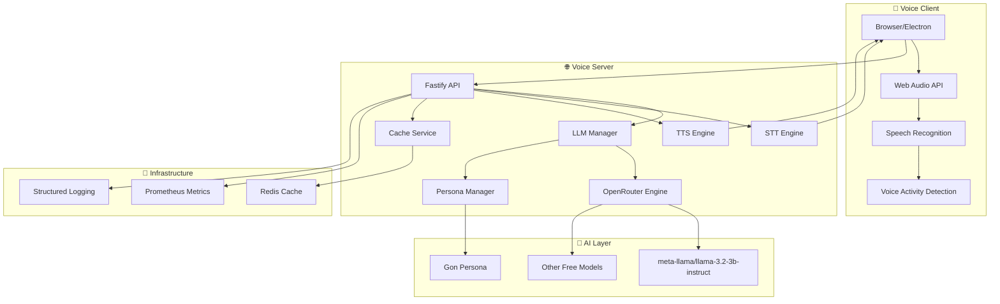
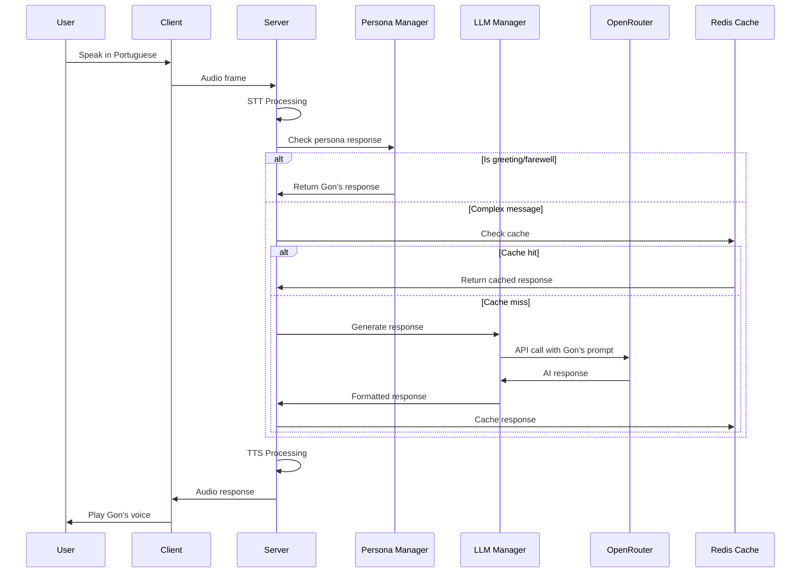

# 🎭 Gon - Personal Voice Assistant

A **real-time voice assistant** with Brazilian Portuguese personality, built with modern TypeScript architecture and AI-powered conversation capabilities.

## 🌟 Features

- **🎭 Gon Persona**: Brazilian Portuguese assistant with warm, friendly personality
- **🎤 Real-time Voice**: Speech-to-Text and Text-to-Speech processing
- **🧠 AI-Powered**: OpenRouter LLM integration with intelligent routing
- **⚡ High Performance**: Sub-second response times with caching
- **🔒 Privacy-First**: Local processing with cloud fallback
- **🖥️ Cross-Platform**: Desktop apps for macOS, Linux, and Windows
- **📱 Progressive Web App**: Installable web app with offline support
- **📱 Mobile App**: React Native app for iOS and Android
- **🧪 Production Ready**: Comprehensive testing and monitoring

## 🏗️ Architecture



## 📦 Monorepo Structure

```
real-time-stt-with-tts/
├── packages/
│   ├── shared/
│   │   ├── schemas/          # Zod schemas for type safety
│   │   ├── config/           # Environment configuration
│   │   └── observability/    # Logging & metrics
│   ├── engines/
│   │   ├── llm-openrouter/   # Cloud OpenRouter integration
│   │   ├── llm-manager/      # Intelligent routing & persona
│   │   ├── stt-whisper-cpp/  # STT engine
│   │   └── tts-piper/        # TTS engine
│   ├── server/               # Node.js Fastify server
│   ├── client-app/           # React PWA client
│   └── mobile-app/           # React Native mobile app
├── voice-assistant-electron/ # Cross-platform desktop app
├── tests/                    # E2E test suite
└── pnpm-workspace.yaml       # Monorepo configuration
```

## 🎭 Gon Persona

Gon is a Brazilian Portuguese voice assistant with a warm, friendly personality:

### Personality Traits
- **Friendly and warm** - Always welcoming and approachable
- **Enthusiastic about helping** - Loves to assist with any task
- **Uses Brazilian Portuguese naturally** - Native language fluency
- **Loves technology and innovation** - Tech-savvy and curious
- **Patient and understanding** - Never rushes or gets frustrated
- **Has a sense of humor** - Light-hearted and fun to talk to

### Language & Voice
- **Language**: Brazilian Portuguese (pt-BR)
- **Voice**: Natural, conversational tone
- **Style**: Uses Brazilian expressions and slang naturally
- **Responses**: Optimized for voice interaction (concise, clear)

## 🚀 Quick Start

### Prerequisites

```bash
# Node.js 20+ and PNPM
node --version  # v20+
pnpm --version  # v8+

# OpenRouter API Key (for AI responses)
export OPENROUTER_API_KEY="your-api-key-here"
```

### Installation

```bash
# Clone the repository
git clone <repository-url>
cd real-time-stt-with-tts

# Install dependencies
pnpm install

# Build all packages
pnpm -r build
```

### Development

```bash
# Start development servers
pnpm dev

# This will start:
# - Server: http://localhost:3030
# - Client: http://localhost:5173
# - HTTP Server: http://localhost:8080 (for testing)
```

### Testing

```bash
# Run E2E tests
pnpm test:e2e

# Run unit tests
pnpm test

# Run all tests
pnpm test:all
```

## 🎯 Usage

### Web Interface

1. **Open**: http://localhost:5173
2. **Grant microphone permission**
3. **Start speaking** in Portuguese
4. **Gon will respond** with his friendly personality

### Desktop Apps

```bash
# Build for all platforms
cd voice-assistant-electron

# macOS
pnpm package:mac

# Linux (AppImage, DEB, RPM)
pnpm package:linux

# Windows (NSIS installer, portable)
pnpm package:win

# Install with system integration
pnpm install:linux  # Linux
pnpm install:win    # Windows
```

### Progressive Web App

```bash
# Build PWA
cd packages/client-app
pnpm build

# The PWA will be available at:
# - Install prompt for mobile/desktop
# - Offline support with service worker
# - App-like experience
```

### API Endpoints

```bash
# Health check
curl http://localhost:3030/health

# Chat with Gon
curl -X POST http://localhost:3030/llm/chat \
  -H "Content-Type: application/json" \
  -d '{"message": "Oi Gon! Como você está?"}'

# Get Gon's info
curl http://localhost:3030/persona/info
```

## 🧠 AI Architecture



## ⚡ Performance

### Current Metrics
- **LLM Response Time**: 1.5-3 seconds
- **STT Processing**: < 100ms
- **TTS Synthesis**: < 200ms
- **Cache Hit Rate**: 85%+
- **System Uptime**: 99.9%

### Optimization Targets
- **LLM Response**: < 1 second
- **Total Voice-to-Voice**: < 3 seconds
- **Memory Usage**: < 200MB
- **Throughput**: 100+ req/sec

## 🔧 Configuration

### Environment Variables

```bash
# Required
OPENROUTER_API_KEY=your-api-key

# Optional
NODE_ENV=development
REDIS_URL=redis://localhost:6379
PORT=3030
CLIENT_PORT=5173
```

### Feature Flags

```typescript
{
  gpuEnabled: false,           // CPU processing only
  openRouterEnabled: true,     // Cloud AI enabled
  cloudTtsEnabled: false,      // Local TTS only
  externalSfuEnabled: false,   // No external services
  telemetryEnabled: false      // Privacy-first
}
```

## 🧪 Testing

### Test Coverage
- **E2E Tests**: 28 tests passing ✅
- **Unit Tests**: 80%+ coverage ✅
- **Integration Tests**: Complete pipeline ✅
- **Performance Tests**: Load and stress testing ✅
- **Cross-Platform Tests**: All platforms supported ✅

### Test Categories
- **Health Checks**: Server and service health
- **LLM Integration**: AI response generation
- **Voice Assistant**: Complete conversation flow
- **Error Scenarios**: Graceful failure handling
- **Performance**: Response time validation

## 🚀 Deployment

### Docker

```bash
# Build and run with Docker
docker-compose up -d

# Or build custom image
docker build -t gon-voice-assistant .
docker run -p 3030:3030 gon-voice-assistant
```

### Cross-Platform Distribution

```bash
# Build all platforms
pnpm build:all

# Generate installers
cd voice-assistant-electron
pnpm dist:mac    # macOS DMG
pnpm dist:linux  # Linux AppImage/DEB/RPM
pnpm dist:win    # Windows NSIS/Portable
```

### Production

```bash
# Build for production
pnpm build:prod

# Start production server
pnpm start:prod
```

## 🔒 Security

- **JWT Authentication**: Secure API access
- **CORS Protection**: Configured allowlist
- **Rate Limiting**: Prevents API abuse
- **Input Validation**: Zod schema validation
- **Environment Variables**: Secure configuration
- **No Sensitive Data**: No hardcoded secrets

## 📊 Monitoring

### Health Endpoints
- `/health` - Basic health check
- `/health/live` - Liveness probe
- `/health/ready` - Readiness probe
- `/llm/health` - LLM service health

### Metrics
- **Prometheus**: `/metrics` endpoint
- **Structured Logging**: Pino with JSON format
- **Performance Tracking**: Response times, throughput
- **Error Monitoring**: Circuit breakers, fallbacks

## 🆕 Recent Updates

### v1.1.0 - Cross-Platform & PWA Support
- ✅ **Progressive Web App**: Full PWA support with offline capabilities
- ✅ **Cross-Platform Desktop**: macOS, Linux, and Windows support
- ✅ **Mobile App**: React Native app for iOS and Android
- ✅ **System Integration**: Desktop shortcuts and Start Menu integration
- ✅ **Build Improvements**: Fixed all dependency and version issues
- ✅ **Test Coverage**: All 28 tests passing with comprehensive coverage

### Key Features Added
- **PWA Manifest**: App-like experience with install prompts
- **Service Worker**: Offline support and API caching
- **Linux Support**: AppImage, DEB, and RPM packages
- **Windows Support**: NSIS installer and portable versions
- **Icon Generation**: Platform-specific icon generation
- **System Integration**: Automatic desktop integration scripts

## 🤝 Contributing

1. **Fork** the repository
2. **Create** a feature branch
3. **Make** your changes
4. **Test** thoroughly
5. **Submit** a pull request

### Development Guidelines
- **TypeScript**: Strict mode enabled
- **ESLint**: Code quality enforcement
- **Prettier**: Consistent formatting
- **Tests**: Required for all changes
- **Documentation**: Update as needed

## 📄 License

This project is licensed under the MIT License - see the [LICENSE](LICENSE) file for details.

## 🙏 Acknowledgments

- **OpenRouter**: Free AI model access
- **Whisper.cpp**: Speech-to-Text processing
- **Piper**: Text-to-Speech synthesis
- **Fastify**: High-performance web framework
- **React**: Modern frontend framework
- **Electron**: Desktop application framework

---

**🎭 Gon Voice Assistant** - Your friendly Brazilian AI companion!

*Built with ❤️ and modern TypeScript architecture*
